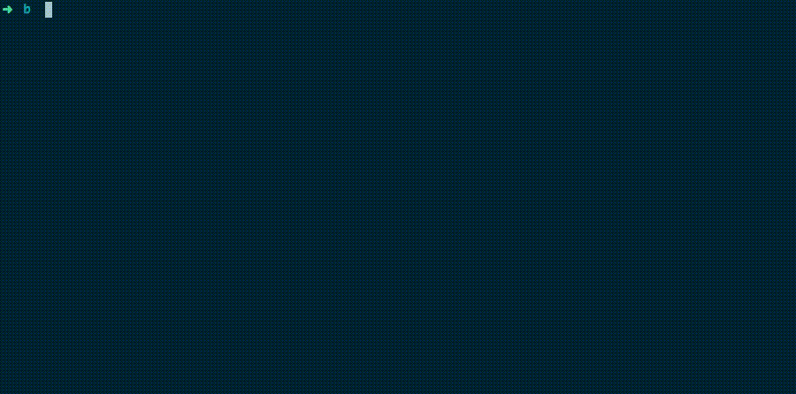

<h1 align="center">
  Blade
  
  <br/>
  
</h1>

Automatically build and rebuild XCode image catalogs for app icons, universal images, and more.


* Use in existing projects to generate image catalogs with no extra work. Blade will automagically refresh your image catalogs based on given master images.
* Use templates of image catalogs to generate new catalogs (see [templates](templates/)).




## Why?

Because most of the time your image catalogs are the same image, resized to various sizes.

Here is how people solve this usually:

* Have the designer slice the images manually / automatically using a [PSD template](http://appicontemplate.com/)
* Use some sort of [online image slicing service](http://makeappicon.com/) which emails you a zip of the various sizes

The problem with these solutions is:

* Some times the various slices are not up to date with XCode (new devices, new sizes)
* It Almost always require extra work from you (placing each image manually in the catalog, fixing mismatches etc.)
* You can't control the quality of the resize
* You can't integrate the tooling into your build workflow or CI

Blade is an open source tool which will replace the PSD template and/or online services for you, and has a goal to satisfy the above requirements in the best way possible.


## Quick start

Download one of the binaries in [releases](https://github.com/jondot/blade/releases), and put in your `PATH` or just include in each XCode project's root.


#### Use a Bladefile

The best way to use Blade, is to set up a local `Bladefile` for your entire project. Within it, specify all of your resources. Blade will pick it up automatically.

```
$ blade --init
Wrote Bladefile.
```
Here is how your `Bladefile` would look like:

```yaml
blades:
  - source: iTunesArtwork@2x.png
    mount: foobar/Assets.xcassets/AppIcon.appiconset
  - source: Spaceship_1024.png
    mount: foobar/Assets.xcassets/Spaceship.imageset
```

It was made for this project structure:

```
foobar
├── Bladefile
├── images
│   ├── iTunesArtwork@2x.png
│   └── Spaceship_1024.png
├── foobar
│   ├── AppDelegate.swift
│   ├── Assets.xcassets
│   │   ├── AppIcon.appiconset
│   │   │   └── Contents.json
│   │   └── Spaceship.imageset
│   │       ├── Contents.json
```

Then use Blade (use --verbose if you want logs) within the same folder where your `Bladefile` lives:

```
$ blade --verbose
INFO[0000] Found a local Bladefile.
INFO[0000] Bladefile contains 2 blade defs.
...
```

And it will generate all of the images needed within each image catalog.

To make this happen before each build see [how to run a script while building a product](https://developer.apple.com/library/ios/recipes/xcode_help-project_editor/Articles/AddingaRunScriptBuildPhase.html)


#### Use directly

```
$ blade --source=iTunesArtwork@2x.png --template=templates/watch.json --out=out/watch --catalog
```

Here's what we did:

* Use a source image (`--source`)
* Make a brand new image catalog (`--catalog`), from a template (`templates/watch.json`)
* Put everything in `out/watch`


```
$ blade -s iTunesArtwork@2x.png -t existing.imageset -o existing.imageset
```

Here's what we did:

* Use a source image (`-s`)
* Point to an existing image catalog (`-t`)
* Output to that same existing image catalog (`-o`)
* In other words, Blade will refresh the images in this catalog


## How does it work?


Blade parses __the same XCode image catalog__ configuration file as its own configuration source - no new concept introduced. This allows it to be future-proof with XCode updates for new image sizes and catalog types.


Supported workflows:

* __Prototyping__ ad-hoc, while prototyping projects
* __Development__ build with Build Steps, transforming all of your source image assets to image catalogs
* __CI__ in your CI servers, either on OSX or Linux (though Linux can't compile code in this case, you can still use it to do image processing)


## Hacking on Blade

Pull requests are happily accepted.

Here's what you should know if you want to improve Blade:

* Your workflow starting point is the `Makefile`. There you should see how to setup the development tooling, run builds, tests and coverage.
* The architecture splits out the runner from the converter, so that we could swap to other, faster, converters (vips) if needed.
* The other concerns are the `Contents.json` ([contents.go](contents.go)) parsing and dimension ([dimensions.go](dimensions.go)) computation logic.
* Finally, you're left with the Bladefile ([bladefile.go](bladefile.go)) and CLI ([main.go](main.go)) logic to handle.

Also, check out [fixtures](fixtures) for quick image catalog configuration to work with.


# Contributing

Fork, implement, add tests, pull request, get my everlasting thanks and a respectable place here :).


# Copyright

Copyright (c) 2014 [Dotan Nahum](http://gplus.to/dotan) [@jondot](http://twitter.com/jondot). See MIT-LICENSE for further details.


